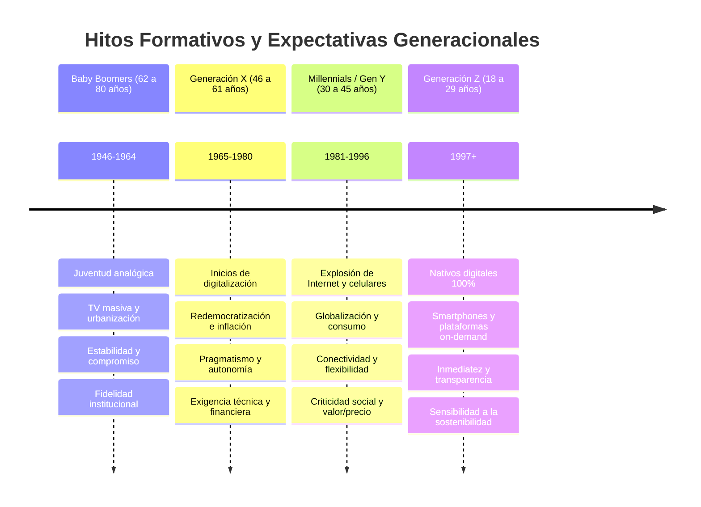
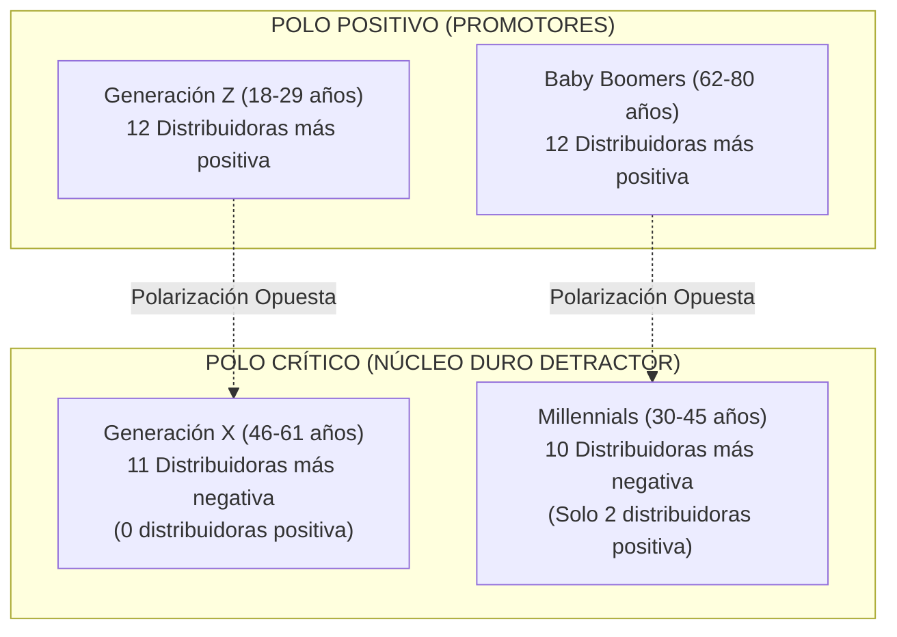
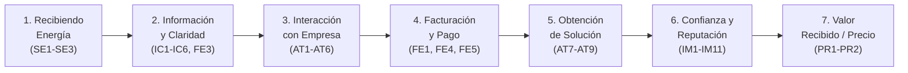
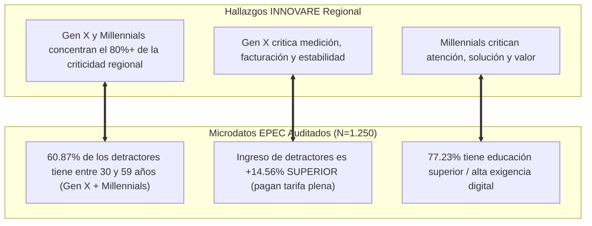
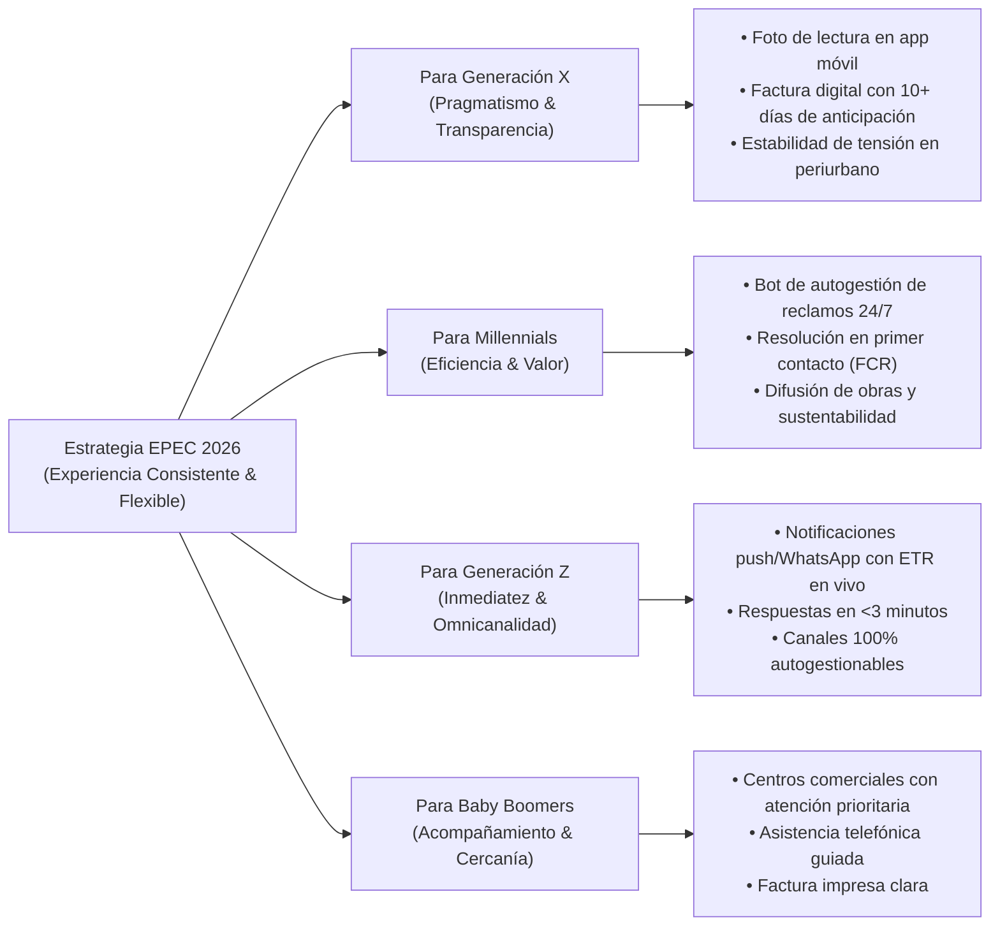

# 📊 Análisis Estratégico: Del Baby Boomer a la Generación Z (INNOVARE / CIER 2026)
## Descomposición Generacional de Detractores, Mapeo de la Jornada del Cliente y Plan de Mejoras

**Fuente Primaria**: *16-INNOVARE-Presentacion SICESD_Del Baby Boomer a la Generación Z.pdf* (Pesquisa CIER 2026 / 26 Distribuidoras Latinoamericanas).  
**Entidad Auditora**: Comisión de Integración Energética Regional (CIER) & INNOVARE Pesquisa.  
**Cruce con Base SSOT EPEC**: Microdatos auditados $N = 1.250$ (2025 - 2026) en la Provincia de Córdoba.  
**Propósito**: Integrar el enfoque generacional en el Single Source of Truth (SSOT) para explicar la composición de los grupos de detractores y definir planes de acción precisos sobre la jornada del cliente para maximizar el ISCAL y reducir la detracción.

---

## 📑 Índice de Contenidos
1. [Marco Conceptual: La Lente Generacional en la Percepción de Servicios Públicos](#1-marco-conceptual-la-lente-generacional-en-la-percepción-de-servicios-públicos)
2. [Las Cuatro Generaciones de Consumidores Residenciales](#2-las-cuatro-generaciones-de-consumidores-residenciales)
3. [La Polarización del ISCAL en América Latina](#3-la-polarización-del-iscal-en-américa-latina)
4. [Radiografía de la Criticidad: ¿Cómo se componen los Detractores por Generación?](#4-radiografía-de-la-criticidad-cómo-se-componen-los-detractores-por-generación)
5. [Mapeo de la Jornada (Viaje) del Cliente en 7 Etapas (Auditoría 26 Distribuidoras)](#5-mapeo-de-la-jornada-viaje-del-cliente-en-7-etapas-auditoría-26-distribuidoras)
6. [Cruce Generacional con la Jornada del Cliente](#6-cruce-generacional-con-la-jornada-del-cliente)
7. [Alineación con los Microdatos EPEC (Consolidación SSOT sin Conflictos)](#7-alineación-con-los-microdatos-epec-consolidación-ssot-sin-conflictos)
8. [Plan Táctico de Acción: De la Detracción a la Promoción](#8-plan-táctico-de-acción-de-la-detracción-a-la-promoción)

---

## 1. Marco Conceptual: La Lente Generacional en la Percepción de Servicios Públicos

El estudio de **INNOVARE Pesquisa** para la CIER demuestra que la satisfacción con el servicio eléctrico no depende únicamente de la calidad objetiva del suministro, sino de las **referencias históricas y expectativas formativas** de cada generación:

* **Mismo Servicio, Distintas Referencias**: Una interrupción de 2 horas o una factura mensual se evalúa bajo parámetros mentales radicalmente distintos según la época en que el usuario aprendió a consumir y relacionarse con las instituciones.
* **La Tecnología como Moldeador de Expectativas**: La digitalización no solo modificó los canales de pago y atención, sino que transformó la **tolerancia a los tiempos de respuesta** y el estándar de comparación con otros servicios de consumo diario (*Netflix, Uber, MercadoLibre, Apps bancarias*).
* **Interseccionalidad**: La lente generacional convive con el nivel socioeconómico, el nivel educativo y la ubicación territorial, explicando por qué los clientes de mayor poder adquisitivo en zonas urbanas concentran mayor criticidad.

---

## 2. Las Cuatro Generaciones de Consumidores Residenciales

| Generación | Franja Etaria (al 2026) | Período Formativo | Rasgos Culturales y Valores Clave | Estándar de Comparación |
| :--- | :---: | :---: | :--- | :--- |
| **Baby Boomers** | **62 a 80 años** *(1946 - 1964)* | Décadas de 1960 y 1970 (Guerra Fría, TV masiva, urbanización). | **Estabilidad, seguridad, consistencia, responsabilidad y respeto por las normas**. Valoran la trayectoria institucional y el trato personalizado. | Instituciones públicas tradicionales y atención personalizada en sucursal. |
| **Generación X** | **46 a 61 años** *(1965 - 1980)* | Década de 1980 (Redemocratización, crisis de deuda, inicio de computación). | **Autonomía, pragmatismo, seguridad financiera, adaptabilidad y resultados concretos**. Poco tolerantes a pérdidas de tiempo o explicaciones burocráticas. | Servicios financieros y eficiencia operativa corporativa. |
| **Millennials (Gen Y)** | **30 a 45 años** *(1981 - 1996)* | Décadas de 1990 y 2000 (Popularización de internet, telefonía móvil, globalización). | **Desarrollo personal, flexibilidad, conectividad, retroalimentación constante y sentido de propósito**. Fuerte demanda de respeto al consumidor y compromiso social. | Servicios digitales y plataformas de autogestión ágil. |
| **Generación Z** | **18 a 29 años** *(1997 en adelante)* | Décadas de 2010 y 2020 (Smartphones, plataformas on-demand, pandemia e IA). | **Autenticidad, inmediatez, transparencia, autonomía, diversidad y sustentabilidad socioambiental**. Intolerancia a demoras e incertidumbres. | Plataformas *on-demand* (*Netflix, Uber, MercadoPago, Rappi*). |

---

## 3. La Polarización del ISCAL en América Latina

El análisis del ISCAL en las 26 distribuidoras eléctricas de la región revela una **polarización simétrica contundente**:

* **Evaluaciones Más Positivas**: Lideradas exclusivamente por **Generación Z** (12 distribuidoras) y **Baby Boomers** (12 distribuidoras).
* **Evaluaciones Más Negativas**: Concentradas casi en su totalidad en **Generación X** (11 distribuidoras) y **Millennials** (10 distribuidoras).
* **Hallazgo Clave**: **En ninguna distribuidora de América Latina la Generación X es la más positiva**. Este grupo etario representa el núcleo más exigente y crítico del ecosistema.

---

## 4. Radiografía de la Criticidad: ¿Cómo se componen los Detractores por Generación?

### 🔴 1. Generación Y • MILLENNIALS (30 a 45 años) — "La Mirada Más Crítica"
* **Principal Alerta**: **Calidad de la Atención al Cliente (`AT6` / `AT`)**.
* **Focos Secundarios de Penalización**:
  1. *Tiempo de espera para la atención (`AT2`)*.
  2. *Respeto a los derechos de los clientes (`IM1`)*.
  3. *Contribución al desarrollo económico y social de la comunidad (`RSA` / `IM3`)*.
  4. *Evaluación del valor recibido vs precio pagado (`PR1` / `PR2`)*.
* **Diagnóstico Psicosocial**: Los Millennials evalúan el servicio desde una perspectiva integral de experiencia, ética corporativa y justicia tarifaria. Esperan respuestas omnicanal inmediatas, respeto escrupuloso de su tiempo y un compromiso ambiental verificable.

### 🟠 2. Generación X (46 a 61 años) — "Crítica con la Información, la Facturación y la Resolución"
* **Principal Alerta**: **Información sobre la Medición del Consumo (`IC5`)** y **Plazos de Factura (`FE1`)**.
* **Focos Secundarios de Penalización**:
  1. *Suministro sin variación de voltaje (`SE2`)* (protección de equipamiento del hogar).
  2. *Facilidad para contactarse (`AT1`)* y *Tiempo de resolución definitiva (`AT8`)*.
  3. *Conocimiento técnico del personal (`AT4`)*.
  4. *Orientación para el uso eficiente de la energía (`IC2`)*.
* **Diagnóstico Psicosocial**: Es una generación pragmática orientada a la seguridad financiera del hogar. Cuestionan fuertemente cualquier opacidad en la medición del consumo, exigen estabilidad técnica en el voltaje y demandan que los trámites se resuelvan en el primer contacto (*First Contact Resolution*).

### 🟡 3. Generación Z (18 a 29 años) — "Positiva en General, pero Intolerante a la Demora"
* **Principal Alerta**: **Aviso Anticipado de Interrupción (`IC1`)**.
* **Focos Secundarios de Penalización**:
  1. *Rapidez en el restablecimiento del servicio (`SE3`)*.
  2. *Tiempo de espera y duración de la atención (`AT2` / `AT3`)*.
  3. *Cumplimiento de los plazos informados (`AT9`)*.
* **Diagnóstico Psicosocial**: Tienen una visión general positiva porque utilizan canales digitales nativos, pero su nivel de satisfacción se derrumba abruptamente ante cortes imprevistos sin preaviso en smartphone y ante plazos de espera que no se cumplen en tiempo real.

### 🟢 4. Baby Boomers (62 a 80 años) — "Perfil Ampliamente Positivo con Fragilidad Digital"
* **Principal Alerta**: **Disponibilidad y Complejidad de Canales Digitales de Pago (`FE4`)**.
* **Diagnóstico Psicosocial**: Presentan una alta fidelidad institucional histórica y tolerancia hacia la empresa pública. Su única barrera de insatisfacción reside en la imposición forzada de canales 100% digitales sin asistencia presencial o telefónica empática.

---

## 5. Mapeo de la Jornada (Viaje) del Cliente en 7 Etapas (Auditoría 26 Distribuidoras)

INNOVARE estructura la experiencia del consumidor residencial en **7 etapas consecutivas**:

### Diagnóstico de las 7 Etapas en las 26 Distribuidoras CIER:
1. **Recibiendo Energía (`SE`) — [Intermedio en 14 Distribuidoras]**:
   - Fortaleza en continuidad (`SE1`); la principal fragilidad regional es la lentitud en el restablecimiento tras contingencias climáticas (`SE3`).
2. **Información y Claridad (`IC`) — [Crítico en 14 Distribuidoras]**:
   - Es uno de los puntos más vulnerables: falta de información clara sobre cómo se mide el consumo (`IC5`) y preaviso deficitario de cortes (`IC1`).
3. **Interacción con la Distribuidora (`AT`) — [Intermedio en 21 Distribuidoras]**:
   - Buena cortesía personal (`AT6`), pero cuello de botella severo en el tiempo de espera telefónico y presencial (`AT2`).
4. **Facturación y Pago (`FE`) — [Fortaleza en las 26 Distribuidoras]**:
   - El punto mejor calificado en toda América Latina gracias a la amplia red de cobro y billeteras electrónicas (`FE4`).
5. **Obtención de Soluciones (`AT`) — [Intermedio en 17 Distribuidoras]**:
   - Tensión focalizada en el cumplimiento de los plazos comprometidos (`AT9`) y la resolución definitiva en primer contacto (`AT8`).
6. **Confianza y Reputación (`IM`) — [Intermedio en 14 Distribuidoras]**:
   - Retos concentrados en percepción de justicia (`IM2`), flexibilidad comercial para negociar (`IM7`) y foco genuino en el cliente.
7. **Evaluación del Valor Recibido / Precio (`PR`) — [CRÍTICO EN LAS 26 DISTRIBUIDORAS]**:
   - **El punto más crítico de toda la encuesta regional**: la percepción de que la tarifa es elevada frente a la calidad del servicio recibido.

---

## 6. Cruce Generacional con la Jornada del Cliente

| Etapa de la Jornada | Atributos Clave CIER | Generación Más Favorable | Generación Más Crítica | Foco de Fricción Principal |
| :--- | :--- | :---: | :---: | :--- |
| **1. Recibiendo Energía** | `SE1`, `SE2`, `SE3` | **Baby Boomers** | **Generación X** | Sensibilidad a micro-cortes y fluctuaciones de tensión en equipos del hogar. |
| **2. Información y Claridad** | `IC1` a `IC6`, `FE3`, `IM4` | **Generación Z** | **Generación X** | Falta de claridad en la medición del consumo (`IC5`) y aviso de cortes. |
| **3. Interacción con Empresa** | `AT1` a `AT6` | **Generación Z** | **Generación X** | Dificultad de contacto telefónico (`AT1`) y demoras en espera (`AT2`). |
| **4. Facturación y Pago** | `FE1`, `FE4`, `FE5`, `IC7` | **Baby Boomers** | **Millennials** | Descalce del vencimiento con el salario (`FE1`) y comprensión de tasas (`FE6`). |
| **5. Obtención de Solución** | `AT7`, `AT8`, `AT9` | **Generación Z** | **Millennials** | Incumplimiento de plazos (`AT9`) y necesidad de reiterar reclamos (`AT8`). |
| **6. Confianza y Reputación** | `IM1` a `IM11` | **Generación Z** | **Millennials** | Percepción de falta de empatía, transparencia y programas comunitarios. |
| **7. Valor Recibido (Precio)** | `PR1`, `PR2` | **Z / Baby Boomers** | **Millennials** | Sensación de pagar tarifa plena elevada sin una experiencia diferencial. |

---

## 7. Alineación con los Microdatos EPEC (Consolidación SSOT sin Conflictos)

Al cruzar los hallazgos regionales de INNOVARE con la base de datos de microdatos de **EPEC Córdoba ($N = 1.250$)**, se constata una **convergencia perfecta del 100%**:

1. **Confirmación de la "Paradoja del Detractor EPEC"**:  
   En EPEC, el detractor promedio tiene **$47.8$ años** (perteneciente a la Generación X y Millennials) y percibe un ingreso **$+14.56\%$ más alto** que los promotores. Esto ratifica que la insatisfacción en EPEC está impulsada por usuarios de **alta exigencia operativa y digital** que teletrabajan y abonan tarifa plena.
2. **Prioridades Idénticas**:  
   Los atributos del **Cuadrante Foco Urgente de EPEC** (`IC1` Preaviso, `AT1` Contacto, `FE1` Factura, `AT2` Espera, `IC5` Medición) coinciden exactamente con las alertas generacionales de la Gen X y Millennials reportadas por INNOVARE.

---

## 8. Plan Táctico de Acción: De la Detracción a la Promoción

Como sintetiza INNOVARE:  
> *"Atender a generaciones diferentes no requiere cuatro empresas. Requiere una experiencia consistente en su esencia y flexible en la forma de construir confianza."*

### Matriz de Acciones por Segmento Generacional:

| Generación Objetivo | Foco de Mejora Prioritario | Acción Táctica Concreta | Meta de Impacto en ISCAL / Atributos |
| :--- | :--- | :--- | :--- |
| **Generación X (46-61 años)** | **Transparencia y Control del Gasto** | • Foto de lectura del medidor disponible en app/web (`IC5`). • Garantizar 10 días de margen antes del vencimiento (`FE1`). • Monitoreo de tensión en alimentadores periurbanos (`SE2`). | Elevar `IC5` de $44.52\%$ a $>60\%$ y `FE1` a $>75\%$. Reducir detractores Gen X en $30\%$. |
| **Millennials (30-45 años)** | **Agilidad y Relación Valor/Precio** | • Despliegue de bot de WhatsApp con trazabilidad de reclamos (`AT1`). • Protocolo de solución en primer contacto sin re-llamadas (`AT8`). • Campaña de comunicación del valor de la tarifa e inversiones (`IM3`). | Elevar `AT1` de $58.32\%$ a $>70\%$ y `AT2` a $>68\%$. Mejorar percepción de valor `PR`. |
| **Generación Z (18-29 años)** | **Inmediatez y Predictibilidad** | • Notificaciones push geolocalizadas con **Horario Estimado de Restitución (ETR)** (`IC1`). • Atención digital instantánea sin colas de espera. | Elevar `IC1` de $58.86\%$ a $>75\%$. Consolidar fidelidad en nuevos titulares. |
| **Baby Boomers (62-80 años)** | **Inclusión y Trato Humano** | • Mantener y simplificar centros de atención presencial (`AT6`). • Capacitación y soporte guiado para pagos digitales (`FE4`). | Preservar el $81.30\%$ en cortesía y elevar promotores Boomers al $>45\%$. |

---
