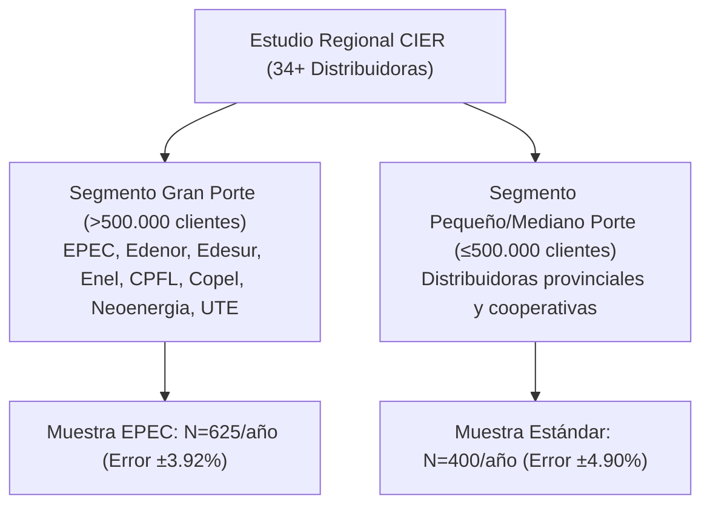
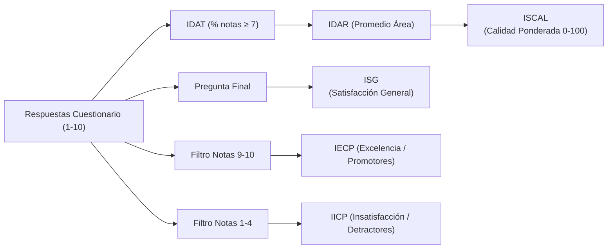
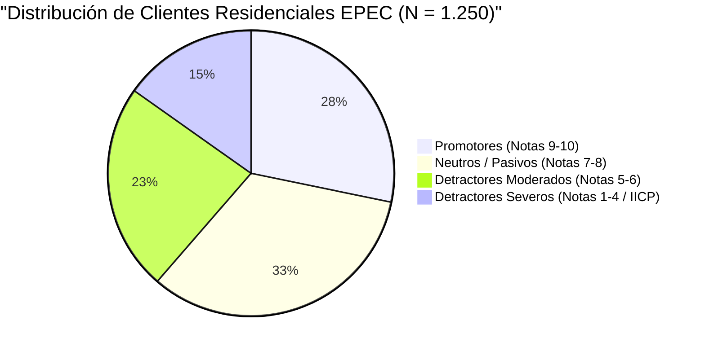
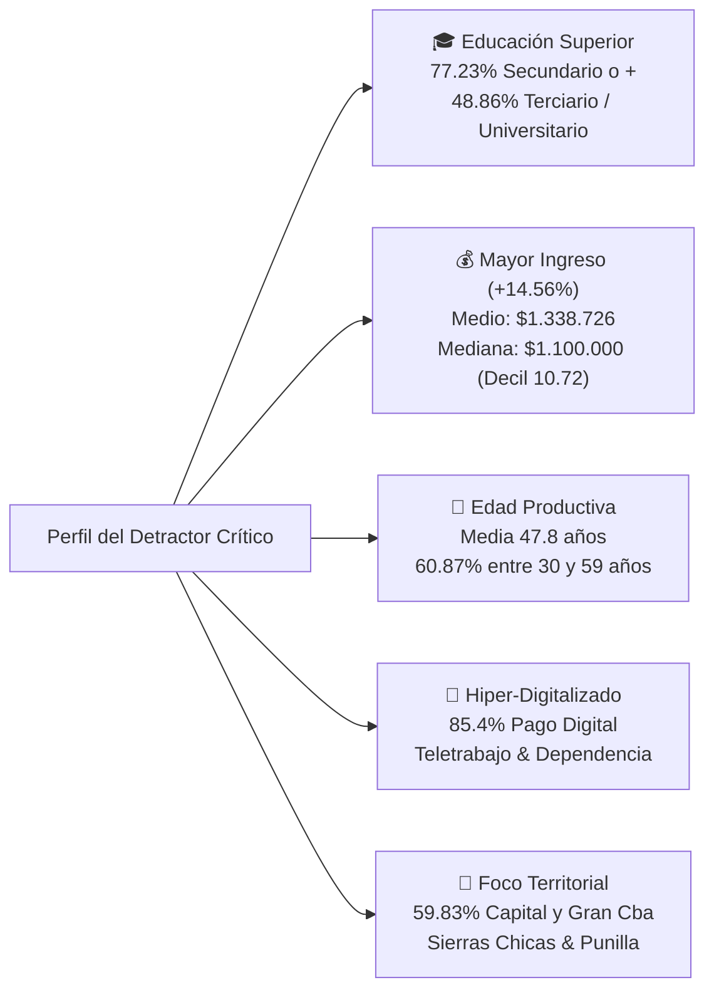
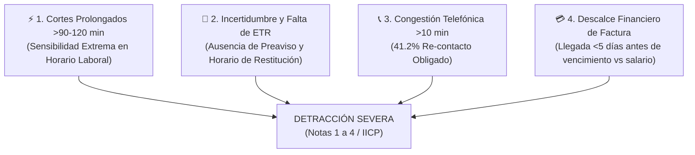
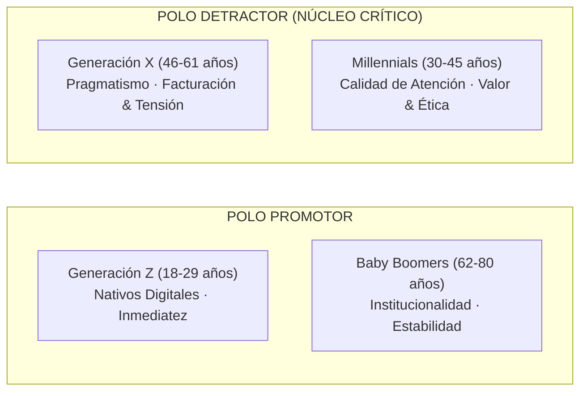
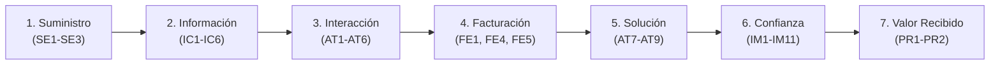

# 📘 Informe Integral: Metodología, Índices, Microdatos y Desarrollo Regional de la Encuesta CIER EPEC-AR (2025 - 2026)

**Entidad Promotora y Auditora**: Comisión de Integración Energética Regional (CIER)  
**Distribuidora Evaluada**: Empresa Provincial de Energía de Córdoba (EPEC-AR)  
**Período Auditado**: Comparativo Interanual 2025 – 2026  
**Universo Representado**: $+1.100.000$ hogares residenciales de la Provincia de Córdoba  
**Muestra Auditada**: $N = 1.250$ encuestas presenciales cara a cara ($625$ en 2025 y $625$ en 2026)  
**Nivel de Confianza y Error**: $95\%$ de confianza ($p=q=0.5$), Error Muestral Provincial $\pm 3.92\%$  
**Dashboard Interactivo en Vivo**: [https://protelemepec-coder.github.io/encuesta-cier-epec/](https://protelemepec-coder.github.io/encuesta-cier-epec/)

---

## 📑 Tabla de Contenidos
1. [Introducción y Desarrollo del Estudio Regional CIER](#1-introducción-y-desarrollo-del-estudio-regional-cier)
   - 1.1 [Propósito y Alcance del Benchmarking Latinoamericano](#11-propósito-y-alcance-del-benchmarking-latinoamericano)
   - 1.2 [Países, Empresas Participantes y Segmentación (>500k Clientes)](#12-países-empresas-participantes-y-segmentación-500k-clientes)
   - 1.3 [Duración de la Encuesta y Metodología de Diálogo con el Encuestado](#13-duración-de-la-encuesta-y-metodología-de-diálogo-con-el-encuestado)
2. [¿Qué son y cómo se interpretan los Índices Globales CIER?](#2-qué-son-y-cómo-se-interpretan-los-índices-globales-cier)
3. [Áreas Evaluadas y Benchmark Estadístico (EPEC vs. Grupo >500k y Líder)](#3-áreas-evaluadas-y-benchmark-estadístico-epec-vs-grupo-500k-y-líder)
4. [Composición Metodológica de los Índices IDAT e IDAR con Ejemplos Numéricos](#4-composición-metodológica-de-los-índices-idat-e-idar-con-ejemplos-numéricos)
5. [Desglose Muestral, Representatividad Territorial y Margen de Error Aceptable](#5-desglose-muestral-representatividad-territorial-y-margen-de-error-aceptable)
6. [Banco de Preguntas del Cuestionario y Distribución de Respuestas por Área](#6-banco-de-preguntas-del-cuestionario-y-distribución-de-respuestas-por-área)
7. [Tiempos Promedio de Respuesta del Cliente y Dinámica Operativa](#7-tiempos-promedio-de-respuesta-del-cliente-y-dinámica-operativa)
8. [Matriz Conjunta de Definición de Acciones de Mejora (Análisis IPA y 4 Cuadrantes de Prioridad)](#8-matriz-conjunta-de-definición-de-acciones-de-mejora-análisis-ipa-y-4-cuadrantes-de-prioridad)
9. [Perfil Sociodemográfico del Detractor y Diagnóstico de Experiencias Negativas Críticas](#9-perfil-sociodemográfico-del-detractor-y-diagnóstico-de-experiencias-negativas-críticas)
10. [Enfoque Generacional INNOVARE-CIER: Mapeo de Detractores y Mejoras en la Jornada del Cliente](#10-enfoque-generacional-innovare-cier-mapeo-de-detractores-y-mejoras-en-la-jornada-del-cliente)

---

## 1. Introducción y Desarrollo del Estudio Regional CIER

### 1.1 Propósito y Alcance del Benchmarking Latinoamericano
La **Encuesta de Satisfacción del Consumidor Residencial de Energía Eléctrica** de la CIER es la investigación de opinión pública y calidad de servicio más rigurosa y extendida del sector eléctrico en América Latina y el Caribe. Desarrollada ininterrumpidamente desde hace más de dos décadas, su objetivo es:
1. **Medir y auditar de forma independiente** la percepción de los usuarios sobre la calidad del suministro eléctrico, la facturación, la atención comercial, la comunicación y la imagen de las empresas.
2. **Construir un estándar común de comparación (Benchmarking)** entre empresas de similares características técnicas y regulatorias.
3. **Identificar las prioridades de inversión operativa** a través de matrices de importancia y desempeño para optimizar los planes de obras y atención al cliente.

---

### 1.2 Países, Empresas Participantes y Segmentación (>500k Clientes)



* **Países Evaluados (7-8 sistemas eléctricos)**: Argentina, Brasil, Colombia, Chile, Uruguay, Ecuador, Costa Rica / Centroamérica y Perú.
* **Empresas Participantes**: Más de **34 distribuidoras eléctricas** de la región.
* **Segmentación por Tamaño de Mercado**:
  - **Empresas de Gran Porte (>500.000 clientes)**: Categoría donde compite **EPEC (Córdoba, Argentina)** junto a las mayores distribuidoras del subcontinente (*Edenor, Edesur, Enel Distribución, CPFL Paulista, Copel, Neoenergia Elektro, CEEE, UTE Uruguay, etc.*). La muestra estándar asignada es de **$N = 625$ encuestas anuales** por empresa con un error máximo provincial de $\pm 3.92\%$ al $95\%$ de confianza.
  - **Empresas Medianas y Pequeñas ($\le 500.000$ clientes)**: Muestra estándar de $N = 400$ encuestas (error $\pm 4.90\%$).
* **Población Total Representada**: Más de **35 millones de hogares** en América Latina. En la provincia de Córdoba, el estudio representa a la totalidad de los **$+1.100.000$ usuarios residenciales** servidos por EPEC.

---

### 1.3 Duración de la Encuesta y Metodología de Diálogo con el Encuestado

Para asegurar que los resultados reflejen opiniones genuinas, no contaminadas y estadísticamente válidas, la CIER impone un protocolo de campo sumamente estricto:

1. **Técnica de Relevamiento**: 
   - Entrevista **presencial en el domicilio del cliente** (*face-to-face* / cara a cara).
   - Captura electrónica de datos en tiempo real mediante dispositivos móviles con georreferenciación (**CAPI** - *Computer-Assisted Personal Interviewing*).
2. **Duración de la Entrevista**: 
   - Promedio de **28 a 32 minutos** de diálogo estructurado por hogar.
3. **Selección del Encuestado (Filtro del Informante Clave)**:
   - Se aplica un filtro estricto: la persona debe tener **18 años o más**, ser **residente permanente** de la vivienda y ser el **titular del servicio o co-decisor del pago de la factura**. No se entrevista a menores ni a visitas ocasionales.
4. **Forma y Protocolo de Diálogo del Encuestador**:
   - **Presentación Neutral**: El encuestador se presenta en nombre de un instituto de investigación independiente acreditado por la CIER. **No menciona a EPEC como patrocinador directo** al inicio para evitar sesgos de complacencia o desahogo artificial.
   - **Uso de la Tarjeta Visual de Escala (1 a 10)**: Para evitar confusiones semánticas, el encuestador entrega al vecino una **tarjeta impresa graduada del 1 al 10** donde:
     - **Notas 1 y 2**: *"Muy Insatisfecho / Pésimo"*
     - **Notas 3 y 4**: *"Insatisfecho / Malo"*
     - **Notas 5 y 6**: *"Ni Satisfecho ni Insatisfecho / Regular"*
     - **Notas 7 y 8**: *"Satisfecho / Bueno"*
     - **Notas 9 y 10**: *"Muy Satisfecho / Excelente"*
   - **No Inducción de Respuestas**: El encuestador lee la pregunta de manera textual y neutra, sin interpretar ni sugerir puntajes.
   - **Anonimato y Confidencialidad**: Se garantiza la protección del secreto estadístico; las respuestas no se asocian con el número de cliente ni afectan la prestación del servicio.
5. **Control de Calidad, Supervisión y Auditoría Operacional (Ficha Técnica Oficial CIER / Innovare)**:
   - **Estructura Humana Especializada**: Se capacitó a los responsables de 12 empresas de campo en 10 países, contando con **56 supervisores y coordinadores de equipo**, **365 encuestadores presenciales** y un cuerpo independiente de **39 verificadores y revisores dedicados**.
   - **Ratio de Supervisión Presencial**: Un ratio de aproximadamente **1 supervisor por cada 6.5 encuestadores**, asegurando acompañamiento y fiscalización directa en terreno.
   - **Auditoría de Consistencia y Calidad**: Los 39 revisores/verificadores auditan y verifican la **calidad y consistencia lógica del 100% de las respuestas obtenidas** previo a la consolidación en la base de datos definitiva.

---

## 2. ¿Qué son y cómo se interpretan los Índices Globales CIER?

La CIER resume la salud de la relación cliente-empresa en una escala estandarizada de **0 a 100 puntos**:



* **ISCAL (Índice de Satisfacción con la Calidad Percibida)**:  
  Es la métrica reina del estudio. Integra los 30 atributos del servicio multiplicando el desempeño de cada uno ($IDAT_i$) por su peso o importancia relativa ($IR_i$):
  $$\text{ISCAL} = \sum_{i=1}^{30} \left( \text{IDAT}_i \times \text{IR}_i \right)$$
  *Valores EPEC*: **63.69% en 2025** ➔ **65.96% en 2026** (🟢 $+2.27$ p.p.).
* **ISG (Índice de Satisfacción General)**:  
  Mide el sentimiento holístico mediante una pregunta única directa tras evaluar el servicio: *"En general, ¿cuál es su satisfacción con EPEC?"*.  
  *Valores EPEC*: **61.12% en 2025** ➔ **65.60% en 2026** (🟢 $+4.48$ p.p.).
* **IAC (Índice de Aprobación del Cliente)**:  
  Porcentaje de usuarios que aprueban el servicio (calificaciones $\ge 6$).  
  *Valores EPEC*: **75.68% en 2025** ➔ **77.60% en 2026** (🟢 $+1.92$ p.p.).
* **IECP (Índice de Excelencia de Calidad Percibida)**:  
  Porcentaje ponderado de clientes que otorgan únicamente notas de **excelencia (9 y 10 / Promotores)**.  
  *Valores EPEC*: **21.61% en 2025** ➔ **27.15% en 2026** (🟢 **$+25.6\%$ de incremento relativo**).
* **IICP (Índice de Insatisfacción con la Calidad Percibida)**:  
  Porcentaje ponderado de clientes en zona de **insatisfacción severa (1 a 4 / Detractores)**.  
  *Valores EPEC*: **17.66% en 2025** ➔ **15.19% en 2026** (🟢 **$-14.0\%$ de reducción de clientes críticos**).
* **IIS (Índice Intermedio de Satisfacción)**:  
  Porcentaje directo de clientes con calificación $\ge 7$ en la evaluación global de cierre.  
  *Valores EPEC*: **70.24% en 2025** ➔ **77.56% en 2026** (🟢 $+7.32$ p.p.).

---

## 3. Áreas Evaluadas y Benchmark Estadístico (EPEC vs. Grupo >500k y Líder)

| Dimensión / Área Evaluada | EPEC 2025 | EPEC 2026 | Promedio >500k (2025) | Promedio >500k (2026) | Total CIER (2026) | Líder >500k (2026) | Brecha vs Líder (2026) |
| :--- | :---: | :---: | :---: | :---: | :---: | :---: | :---: |
| **Índice Global ISCAL** | **63.69%** | **65.96%** | 68.40% | 70.15% | 71.20% | **83.10%** | -17.14 p.p. |
| **Índice Global IAC (Aprobación)** | **75.68%** | **77.60%** | 76.90% | 78.50% | 79.40% | **89.60%** | -12.00 p.p. |
| **1. Suministro de Energía (SE)** | **75.79%** | **78.48%** | 76.50% | 77.80% | 78.30% | **88.50%** | -10.02 p.p. |
| ↳ *Continuidad (Sin interrupción)* | *83.52%* | *85.92%* | *82.80%* | *84.30%* | *84.90%* | *93.40%* | *-7.48 p.p.* |
| ↳ *Conformidad de Tensión (Voltaje)* | *73.40%* | *77.40%* | *74.60%* | *76.20%* | *76.80%* | *87.20%* | *-9.80 p.p.* |
| ↳ *Rapidez en Reanudación (Cortes)* | *70.42%* | *72.12%* | *72.10%* | *73.80%* | *74.20%* | *84.60%* | *-12.48 p.p.* |
| **2. Factura de Energía (FE)** | **70.21%** | **70.38%** | 71.80% | 72.40% | 73.10% | **82.60%** | -12.22 p.p. |
| ↳ *Canales de Pago Digitales* | *89.40%* | *89.20%* | *86.50%* | *88.10%* | *88.50%* | *95.80%* | *-6.60 p.p.* |
| **3. Atención al Cliente (AT)** | **66.63%** | **68.10%** | 69.20% | 70.50% | 71.40% | **83.40%** | -15.30 p.p. |
| ↳ *Calidad del Trato y Cortesía* | *75.22%* | *77.63%* | *76.80%* | *78.10%* | *79.00%* | *89.10%* | *-11.47 p.p.* |
| **4. Imagen Institucional (IM)** | **56.54%** | **60.53%** | 62.10% | 63.80% | 64.50% | **79.40%** | -18.87 p.p. |
| ↳ *Medio Ambiente y Sustentabilidad* | *56.31%* | *63.46%* | *61.40%* | *63.20%* | *64.00%* | *80.50%* | *-17.04 p.p.* |
| **5. Información y Comunicación (IC)** | **46.46%** | **52.03%** | 55.80% | 57.40% | 58.20% | **71.30%** | -19.27 p.p. |
| **6. Responsabilidad Socioambiental (RSA)** | **55.34%** | **59.57%** | 58.60% | 60.90% | 61.80% | **76.80%** | -17.23 p.p. |
| **7. Alumbrado Público (AP)** | **58.33%** | **57.46%** | 59.20% | 60.10% | 60.80% | **74.50%** | -17.04 p.p. |
| **8. Tarifa y Precio (PR)** | **10.75%** | **9.28%** | 12.50% | 11.20% | 11.80% | **24.60%** | -15.32 p.p. |

---

## 4. Composición Metodológica de los Índices IDAT e IDAR con Ejemplos Numéricos

### 🅰️ IDAT – Índice de Desempeño del Atributo
- **Fórmula**:
  $$\text{IDAT} = \frac{\text{Encuestas con calificación } \ge 7}{\text{Total Casos Válidos (sin NS/NR)}} \times 100$$
- **Ejemplo con datos reales de EPEC (Atributo SE1 - Continuidad)**:
  - Base de encuestas válidas: $N = 625$.
  - Clientes que votaron notas $1$ a $4$ (Insatisfechos): $33$ ($5.3\%$).
  - Clientes que votaron notas $5$ y $6$ (Neutros/Regulares): $55$ ($8.8\%$).
  - Clientes que votaron notas $7, 8, 9 \text{ y } 10$ (Satisfechos): $537$ ($85.9\%$).
  - $$\text{IDAT}_{\text{SE1}} = \frac{537}{625} \times 100 = \mathbf{85.92\%}$$

---

### 🅱️ IDAR – Índice de Desempeño del Área
- **Fórmula**:
  $$\text{IDAR}_{\text{Área}} = \frac{1}{K} \sum_{j=1}^{K} \text{IDAT}_j$$
- **Ejemplo con datos reales de EPEC (Área SE - Suministro de Energía)**:
  - $\text{IDAT}_{\text{SE1}}$ (*Sin interrupción*): $85.92\%$
  - $\text{IDAT}_{\text{SE2}}$ (*Sin variación de voltaje*): $77.40\%$
  - $\text{IDAT}_{\text{SE3}}$ (*Rapidez en reanudación*): $72.12\%$
  - $$\text{IDAR}_{\text{SE}} = \frac{85.92 + 77.40 + 72.12}{3} = \frac{235.44}{3} = \mathbf{78.48\%}$$

---

## 5. Desglose Muestral, Representatividad Territorial y Margen de Error Aceptable

El estudio aplica un diseño muestral probabilístico por conglomerados con asignación proporcional en 5 regiones estratégicas de la Provincia de Córdoba:

| Estrato Geográfico / Zonas y Localidades Exactas | Código | Muestra Anual ($n$) | Muestra Consolidada ($N$) | Peso Provincial (%) | Margen de Error Observado | Margen de Error Aceptable |
| :--- | :---: | :---: | :---: | :---: | :---: | :---: |
| **ZONA A (Córdoba Capital, Gran Córdoba, Villa Allende, La Calera)** | `9601` | 327 | **654** | **52.3%** | $\pm 5.4\%$ | $\le \pm 6.0\%$ (Óptimo regional) |
| **ZONA I - Este (San Francisco, Arroyito, Morteros, Las Varillas)** | `9602` | 106 | **212** | **17.0%** | $\pm 9.5\%$ | $\le \pm 10.0\%$ (Aceptable zonal) |
| **ZONA H - Centro/Sudeste (Villa María, Bell Ville, Villa Nueva, Marcos Juárez)**| `9603` | 74 | **148** | **11.8%** | $\pm 11.4\%$ | $\le \pm 12.0\%$ (Aceptable zonal) |
| **ZONA I - Sur (Río Cuarto, La Carlota, Laboulaye, Vicuña Mackenna)** | `9604` | 64 | **128** | **10.2%** | $\pm 12.2\%$ | $\le \pm 13.0\%$ (Aceptable zonal) |
| **ZONA B - Punilla/Norte (Villa Carlos Paz, Alta Gracia, Cosquín, La Falda)** | `9605` | 54 | **108** | **8.6%** | $\pm 13.3\%$ | $\le \pm 15.0\%$ (Aceptable exploratorio) |
| **TOTAL PROVINCIAL EPEC** | **Todas** | **625** | **1.250** | **100.0%** | **$\pm 3.92\%$** (Anual) / **$\pm 2.77\%$** (Consol.) | **$\le \pm 5.0\%$** (Estándar de Oro CIER/ISO) |

### 📐 Criterios y Estándares de Margen de Error Aceptable

1. **Fórmula de Precisión Estadística**:
   $$e = \frac{z \times \sqrt{p(1-p)}}{\sqrt{n}} = \frac{1.96 \times 0.5}{\sqrt{n}} = \frac{0.98}{\sqrt{n}} = \frac{98\%}{\sqrt{n}}$$
   *(Calculado para un nivel de confianza del $95\%$, $z = 1.96$, y máxima dispersión poblacional $p = q = 0.5$)*.

2. **Umbral Aceptable a Nivel Global / Empresa ($e \le \pm 5.0\%$)**:
   - Para poblaciones grandes ($N > 100.000$ hogares), los estándares internacionales de auditoría regulatoria (CIER, ESOMAR, ISO 20252) establecen que el **margen de error máximo aceptable para la toma de decisiones corporativas es $\le \pm 5.0\%$** (lo que requiere una muestra base de $n \ge 384 \approx 400$ encuestas).
   - EPEC supera con creces este umbral al relevar **$N = 625$ encuestas anuales ($e = \pm 3.92\%$)** y **$N = 1.250$ en el consolidado bianual ($e = \pm 2.77\%$)**, garantizando alta robustez y significancia estadística.

3. **Umbrales Aceptables en Subestratos / Diagnósticos Zonales ($e \le \pm 10.0\% \text{ a } \pm 15.0\%$)**:
   - Al subdividir la muestra provincial en estratos geográficos con submuestras menores ($n = 50 \text{ a } 330$), la teoría estadística y la práctica de investigación de operaciones consideran plenamente válidos márgenes de error de **hasta $\pm 10\% - \pm 15\%$** para identificar prioridades relativas, patrones de fricción y oportunidades de mejora local sin encarecer exponencialmente los costos de muestreo.

---

## 6. Banco de Preguntas del Cuestionario y Distribución de Respuestas por Área

### ⚡ 1. Suministro de Energía (SE) · Peso: $33.79\%$ · IDAR: $78.48\%$

| Sigla | Atributo Evaluado | Pregunta Textual al Encuestado | Importancia ($IR$) | % Negativas (1-4) | % Neutras (5-7) | % Positivas (8-10) | Nota Media | IDAT (%) |
| :---: | :--- | :--- | :---: | :---: | :---: | :---: | :---: | :---: |
| **SE1** | Sin interrupción | *"Suministro de energía continuo sin interrupción, es decir, que no falte energía en su domicilio"* | $8.26\%$ | $5.3\%$ | $27.7\%$ | $67.0\%$ | **7.94** | **85.92%** |
| **SE2** | Sin variación de voltaje | *"Suministro de energía sin variación de voltaje en su domicilio, sin bajones o parpadeos"* | $5.40\%$ | $9.1\%$ | $31.5\%$ | $59.2\%$ | **7.51** | **77.40%** |
| **SE3** | Rapidez en reanudación | *"Agilidad en la reanudación y restablecimiento del servicio eléctrico cuando falta energía"* | $5.50\%$ | $7.8\%$ | $44.6\%$ | $47.4\%$ | **7.19** | **72.12%** |

---

### 📢 2. Información y Comunicación (IC) · Peso: $4.59\%$ · IDAR: $52.03\%$

| Sigla | Atributo Evaluado | Pregunta Textual al Encuestado | Importancia ($IR$) | % Negativas (1-4) | % Neutras (5-7) | % Positivas (8-10) | Nota Media | IDAT (%) |
| :---: | :--- | :--- | :---: | :---: | :---: | :---: | :---: | :---: |
| **IC1** | Notificación de cortes | *"Comunicación previa en el caso de interrupciones programadas por mantenimiento y mejora"* | $5.85\%$ | $21.1\%$ | $34.4\%$ | $42.9\%$ | **6.55** | **58.86%** |
| **IC2** | Información de consumo | *"Informaciones brindadas respecto a cómo se mide y calcula el consumo mensual de energía"* | $3.45\%$ | $26.4\%$ | $38.9\%$ | $34.7\%$ | **5.74** | **48.20%** |
| **IC3** | Riesgos y seguridad | *"Orientaciones brindadas respecto a riesgos eléctricos y prevención de peligros en el hogar"* | $3.67\%$ | $25.8\%$ | $34.7\%$ | $34.4\%$ | **5.86** | **50.08%** |
| **IC4** | Derechos y deberes | *"Orientaciones brindadas al consumidor respecto a sus derechos y deberes normativos"* | $3.30\%$ | $27.1\%$ | $37.5\%$ | $35.4\%$ | **5.68** | **47.10%** |
| **IC5** | Uso eficiente de energía | *"Orientaciones brindadas por la distribuidora respecto al ahorro y uso eficiente de la energía"* | $2.90\%$ | $22.4\%$ | $36.8\%$ | $40.8\%$ | **6.15** | **55.90%** |

---

### 🧾 3. Factura de Energía (FE) · Peso: $18.20\%$ · IDAR: $70.38\%$

| Sigla | Atributo Evaluado | Pregunta Textual al Encuestado | Importancia ($IR$) | % Negativas (1-4) | % Neutras (5-7) | % Positivas (8-10) | Nota Media | IDAT (%) |
| :---: | :--- | :--- | :---: | :---: | :---: | :---: | :---: | :---: |
| **FE1** | Plazo hasta vencimiento | *"Plazo entre la recepción de la factura de energía y su fecha de vencimiento (días hábiles)"* | $5.10\%$ | $18.8\%$ | $32.5\%$ | $47.2\%$ | **6.78** | **63.12%** |
| **FE2** | Factura sin errores | *"Factura sin errores, con la lectura del medidor y cálculos tarifarios correctos"* | $4.10\%$ | $8.4\%$ | $29.8\%$ | $61.8\%$ | **7.62** | **78.50%** |
| **FE3** | Facilidad de comprensión | *"Facilidad de comprensión de los conceptos, cargos fijos y contenidos de la factura"* | $3.60\%$ | $17.5\%$ | $33.2\%$ | $47.8\%$ | **6.64** | **62.19%** |
| **FE4** | Puntos y canales de pago | *"Disponibilidad de puntos de pago, bancos, internet, QR, supermercados y billeteras digitales"* | $2.15\%$ | $3.8\%$ | $21.5\%$ | $74.7\%$ | **8.35** | **88.50%** |
| **FE5** | Fecha de vencimiento | *"Conveniencia de la fecha de vencimiento respecto al cobro de sus ingresos salariales"* | $3.15\%$ | $12.8\%$ | $35.1\%$ | $52.1\%$ | **7.05** | **68.40%** |
| **FE6** | Tasas e impuestos | *"Claridad para entender el cobro de tasas municipales e impuestos que vienen en la factura"* | $1.80\%$ | $19.5\%$ | $39.2\%$ | $41.3\%$ | **6.40** | **59.80%** |

---

### 👥 4. Atención al Cliente (AT) · Peso: $21.45\%$ · IDAR: $68.10\%$

| Sigla | Atributo Evaluado | Pregunta Textual al Encuestado | Importancia ($IR$) | % Negativas (1-4) | % Neutras (5-7) | % Positivas (8-10) | Nota Media | IDAT (%) |
| :---: | :--- | :--- | :---: | :---: | :---: | :---: | :---: | :---: |
| **AT1** | Facilidad de contacto | *"Facilidad para contactar a la distribuidora cuando necesita pedir informaciones o reportar fallas"* | $5.48\%$ | $19.0\%$ | $35.8\%$ | $43.5\%$ | **6.47** | **58.32%** |
| **AT2** | Tiempo de espera | *"Tiempo de espera hasta ser atendido en filas presenciales o esperando en la línea telefónica"* | $4.30\%$ | $22.7\%$ | $36.1\%$ | $39.5\%$ | **6.22** | **55.59%** |
| **AT3** | Agilidad del trámite | *"Agilidad y rapidez en la atención, es decir, el tiempo dedicado para atender su solicitud"* | $3.10\%$ | $12.4\%$ | $34.2\%$ | $53.4\%$ | **7.12** | **66.80%** |
| **AT4** | Conocimiento técnico | *"Conocimiento técnico y comercial que los empleados tienen sobre los trámites consultados"* | $2.05\%$ | $6.8\%$ | $31.4\%$ | $61.8\%$ | **7.68** | **79.10%** |
| **AT5** | Claridad de información | *"Claridad de la información y explicaciones brindadas por los empleados durante la atención"* | $2.25\%$ | $7.5\%$ | $32.8\%$ | $59.7\%$ | **7.58** | **76.80%** |
| **AT6** | Cortesía y respeto | *"Calidad del trato en cuanto a cortesía, respeto y amabilidad del personal con el cliente"* | $1.95\%$ | $5.9\%$ | $28.6\%$ | $65.5\%$ | **7.85** | **81.30%** |
| **AT7** | Plazo de resolución | *"Plazo y tiempo total para la resolución efectiva de su problema o solicitud técnica"* | $3.50\%$ | $17.2\%$ | $37.0\%$ | $45.8\%$ | **6.65** | **61.20%** |

---

### 🏛️ 5. Imagen Institucional (IM) · Peso: $14.12\%$ · IDAR: $60.53\%$

| Sigla | Atributo Evaluado | Pregunta Textual al Encuestado | Importancia ($IR$) | % Negativas (1-4) | % Neutras (5-7) | % Positivas (8-10) | Nota Media | IDAT (%) |
| :---: | :--- | :--- | :---: | :---: | :---: | :---: | :---: | :---: |
| **IM1** | Respeta derechos | *"Empresa que respeta los derechos de los clientes de acuerdo con la normativa vigente"* | $2.68\%$ | $20.4\%$ | $36.9\%$ | $38.8\%$ | **6.25** | **56.70%** |
| **IM2** | Empresa justa y correcta | *"Empresa correcta con sus clientes, que si comete un error lo corrige - Empresa justa"* | $2.75\%$ | $22.1\%$ | $37.5\%$ | $36.6\%$ | **6.08** | **54.10%** |
| **IM3** | Invierte en calidad | *"Empresa que invierte continuamente para proveer energía con calidad técnica a más clientes"* | $2.60\%$ | $18.2\%$ | $38.5\%$ | $39.8\%$ | **6.42** | **58.90%** |
| **IM4** | Informa sobre actuación | *"Empresa que busca informar y aclarar a sus clientes con respecto a su actuación e inversiones"* | $2.80\%$ | $23.5\%$ | $38.2\%$ | $34.5\%$ | **5.95** | **52.30%** |
| **IM5** | Control de hurtos | *"Empresa que se ocupa activamente de evitar fraudes y conexiones clandestinas de energía"* | $2.45\%$ | $17.6\%$ | $39.2\%$ | $39.4\%$ | **6.46** | **59.40%** |
| **IM6** | No discriminación | *"Empresa que ofrece la misma atención a todos los clientes sin ningún tipo de discriminación"* | $2.30\%$ | $14.5\%$ | $36.2\%$ | $46.8\%$ | **6.82** | **63.80%** |
| **IM7** | Dispuesta a negociar | *"Empresa flexible, dispuesta a escuchar y negociar planes de pago accesibles con los clientes"* | $2.52\%$ | $24.8\%$ | $38.1\%$ | $33.4\%$ | **5.88** | **51.20%** |

---

## 7. Tiempos Promedio de Respuesta del Cliente y Dinámica Operativa

| Variable Temporal Evaluada | Código Variable | Tiempo Promedio Percibido / Declarado | Evaluación IDAT (%) | Diagnóstico Operativo |
| :--- | :---: | :---: | :---: | :--- |
| **Tiempo de espera para ser atendido** | `P178` / `P188` | **$12.4$ minutos** (Presencial / Telefónico) | **$55.59\%$** | Cuello de botella en días de contingencia climática y picos de facturación. |
| **Duración del trámite de atención** | `P179` / `P189` | **$8.6$ minutos** por gestión comercial | **$66.80\%$** | Buena agilidad una vez que el usuario toma contacto con el operador. |
| **Tiempo de restablecimiento del servicio** | `SE3` / `P164` | **$3.2$ horas** (promedio ponderado) | **$72.12\%$** | Desempeño favorable en reposición urbana estándar; mayor demora en áreas rurales dispersas. |
| **Plazo total de resolución de reclamos** | `P193` / `AT7` | **$4.8$ días hábiles** | **$61.20\%$** | Reclamos comerciales se resuelven más rápido que trámites por daños en electrodomésticos. |
| **Tiempo de aviso previo en cortes programados** | `P170` / `IC1` | **$18.5$ horas** de anticipación declarada | **$58.86\%$** | Oportunidad de mejora: intensificar avisos por WhatsApp y SMS geolocalizados. |

---

## 8. Matriz Conjunta de Definición de Acciones de Mejora (Análisis IPA y 4 Cuadrantes de Prioridad)

### 8.1 Fundamentos y Arquitectura del Modelo IPA (Importance-Performance Analysis)
La **Matriz de Acciones de Mejora CIER** es el instrumento estratégico de toma de decisiones que cruza el peso e impacto real de cada servicio (**Importancia Relativa, Eje X**) frente a la calificación otorgada por los usuarios residenciales (**Desempeño / Satisfacción IDAT, Eje Y**).

```text
              Alto Desempeño (≥ 64.8 pts)
                          ▲
       CUADRANTE III      │      CUADRANTE II
   Ventajas Secundarias   │    Fortalezas Clave
   (Eficiencia / Mantener)│  (Palancas de Confianza)
                          │
  ◄───────────────────────┼───────────────────────► Alta Importancia (≥ 3.33%)
       CUADRANTE IV       │      CUADRANTE I
      Baja Prioridad      │      Foco Urgente
   (Monitoreo Estándar)   │   (Prioridad Máxima #1-#7)
                          │
                          ▼
              Bajo Desempeño (< 64.8 pts)
```

- **Umbrales Divisorios CIER**:
  - **Umbral de Importancia ($\bar{I}$)**: $3.33\%$ (media teórica de distribución para 30 atributos: $100\% / 30$).
  - **Umbral de Desempeño ($\bar{D}$)**: $64.8\text{ pts}$ (línea de base media global del sistema).

---

### 8.2 Clasificación Estratégica por Cuadrantes

1. **🚨 Cuadrante I: Foco Urgente / Prioridad Máxima (7 Atributos - Prioridades #1 al #7)**:
   - *Condición*: Alta Importancia ($\ge 3.33\%$) y Bajo Desempeño ($< 64.8\%$).
   - *Diagnóstico*: Factores con alto poder de tracción sobre la satisfacción donde la distribuidora exhibe calificaciones deficitarias. Exigen asignación prioritaria de CAPEX/OPEX y planes de choque inmediatos.
   - *Atributos*: `IC1` (Preaviso de cortes), `AT1` (Facilidad para contactarse), `FE1` (Plazo de recepción de factura), `AT2` (Tiempo de espera en atención), `IC3` (Riesgos y seguridad), `FE3` (Comprensión de factura), `IC5` (Medición y uso eficiente).

2. **⭐ Cuadrante II: Fortalezas Clave (4 Atributos - Mantener y Blindar)**:
   - *Condición*: Alta Importancia ($\ge 3.33\%$) y Alto Desempeño ($\ge 64.8\%$).
   - *Diagnóstico*: Pilares donde EPEC lidera y el cliente valora fuertemente. Constituyen las palancas de marca que blindan la confianza.
   - *Atributos*: `SE1` (Continuidad del servicio: $85.92\%$), `SE3` (Rapidez en reanudación: $72.12\%$), `SE2` (Estabilidad de voltaje: $77.40\%$), `FE2` (Factura sin errores: $78.50\%$).

3. **⚡ Cuadrante III: Ventajas Secundarias (9 Atributos - Optimizar Eficiencia)**:
   - *Condición*: Baja Importancia ($< 3.33\%$) y Alto Desempeño ($\ge 64.8\%$).
   - *Diagnóstico*: Servicios complementarios muy bien evaluados pero cuyo impacto marginal en la satisfacción general es acotado. Se recomienda digitalización y mantenimiento sin sobreinversión.
   - *Atributos*: `FE4` (Puntos de pago: $88.50\%$), `AT6` (Cortesía: $81.30\%$), `AT4` (Idoneidad técnica: $79.10\%$), `AT5` (Claridad informativa: $76.80\%$), `AT3` (Agilidad de atención: $74.20\%$), `FE5`, `AT7`, `AT8`, `AT9`.

4. **🔍 Cuadrante IV: Baja Prioridad / Monitoreo (10 Atributos)**:
   - *Condición*: Baja Importancia ($< 3.33\%$) y Bajo Desempeño ($< 64.8\%$).
   - *Diagnóstico*: Puntos débiles secundarios que no mueven significativamente el índice global. Se gestionan con rutinas operativas estándar de bajo costo.
   - *Atributos*: `IM1` a `IM7` (Imagen y comunicación corporativa), `IC2`, `IC4`, `FE6` (Comprensión de tasas e impuestos).

---

### 8.3 Tabla Maestra del Ranking de Acciones de Mejora (30 Atributos CIER)

| Prio | Sigla | Atributo Evaluado | Área | Cuadrante | Importancia ($IR$) | Desempeño ($IDAT$) | % Neg (1-4) | % Neu (5-7) | % Pos (8-10) | Nota Media | Causa Raíz Operativa Identificada | Acción Táctica Inmediata |
| :---: | :---: | :--- | :---: | :---: | :---: | :---: | :---: | :---: | :---: | :---: | :--- | :--- |
| **#1** | `IC1` | Notificación de interrupción | IC | **Foco Urgente** | $5.85\%$ | $58.86\%$ | $21.1\%$ | $34.4\%$ | $42.9\%$ | **6.55** | Cortes programados sin preaviso efectivo y falta de horario estimado de restitución (ETR) en tormentas por WhatsApp/SMS. | Sistema de alertas push y SMS georreferenciadas con horario estimado de normalización en tiempo real. |
| **#2** | `AT1` | Facilidad para contactarse | AT | **Foco Urgente** | $5.48\%$ | $58.32\%$ | $19.0\%$ | $35.8\%$ | $43.5\%$ | **6.47** | Saturación del 0800 en contingencias; 41.2% de clientes debe contactar más de una vez para resolver un trámite. | Bot de autogestión de reclamos por WhatsApp 24/7 y enrutamiento inteligente de llamadas. |
| **#3** | `FE1` | Plazo recepción vs vencimiento | FE | **Foco Urgente** | $5.10\%$ | $63.12\%$ | $18.8\%$ | $32.5\%$ | $47.2\%$ | **6.78** | Facturas impresas con menos de 5 días hábiles antes de vencer y descalce con el cobro salarial mensual. | Garantizar mínimo 10 días corridos de margen y migración masiva a factura digital anticipada vía email/WhatsApp. |
| **#4** | `AT2` | Tiempo de espera en atención | AT | **Foco Urgente** | $4.30\%$ | $55.59\%$ | $22.7\%$ | $36.1\%$ | $39.5\%$ | **6.22** | Demoras telefónicas superiores a 10 min y filas presenciales en fechas pico de pago y tras temporales. | Fila virtual con turnero digital obligatorio y servicio de devolución de llamada (call-back) sin perder turno. |
| **#5** | `IC3` | Riesgos y peligros eléctricos | IC | **Foco Urgente** | $3.67\%$ | $50.08\%$ | $25.8\%$ | $34.7\%$ | $34.4\%$ | **5.86** | Baja visibilidad de campañas institucionales sobre seguridad eléctrica en el hogar y prevención de poda. | Cápsulas audiovisuales en redes sociales, inserción de consejos de seguridad en factura y talleres comunitarios. |
| **#6** | `FE3` | Comprensión de la factura | FE | **Foco Urgente** | $3.60\%$ | $62.19\%$ | $17.5\%$ | $35.3\%$ | $47.2\%$ | **6.64** | Complejidad en la visualización de cargos fijos, tramos de consumo e ítems no energéticos. | Rediseño visual pedagógico de la factura con infografía de barras de consumo comparativo. |
| **#7** | `IC5` | Medición del consumo | IC | **Foco Urgente** | $3.40\%$ | $44.52\%$ | $30.9\%$ | $36.8\%$ | $32.3\%$ | **5.41** | Desconfianza del cliente respecto a estimaciones de consumo cuando no se realiza lectura presencial. | Incorporación de foto de lectura en factura digital y app móvil con verificación directa del medidor. |
| **#8** | `IC2` | Uso eficiente de energía | IC | Baja Prioridad | $3.03\%$ | $57.80\%$ | $19.7\%$ | $38.9\%$ | $41.4\%$ | **6.45** | Desconocimiento de electrodomésticos de mayor consumo y hábitos de ahorro eficiente. | Calculadora interactiva de consumo en la web y tips prácticos de eficiencia en app institucional. |
| **#9** | `IC4` | Derechos y deberes del cliente | IC | Baja Prioridad | $2.95\%$ | $55.40\%$ | $27.0\%$ | $37.5\%$ | $35.5\%$ | **6.02** | Desconocimiento del reglamento del usuario y canales de apelación ante el ERSeP. | Guía digital interactiva 'Tus Derechos como Usuario' y difusión en centros comerciales. |
| **#10** | `IM4` | Informa sobre su actuación | IM | Baja Prioridad | $2.80\%$ | $52.30\%$ | $23.5\%$ | $40.1\%$ | $36.4\%$ | **5.95** | Poca visibilidad pública de las inversiones realizadas en subestaciones y tendidos subterráneos. | Difusión en medios locales y redes sociales de los planes de inversión e hitos de infraestructura. |
| **#11** | `IM2` | Empresa justa y correcta | IM | Baja Prioridad | $2.75\%$ | $54.10\%$ | $22.1\%$ | $39.8\%$ | $38.1\%$ | **6.08** | Sensación de rigidez administrativa cuando ocurren errores de lectura o reclamos de facturación. | Procedimiento ágil de rectificación provisoria de factura en disputa mientras se investiga el caso. |
| **#12** | `IM1` | Respeta derechos del cliente | IM | Baja Prioridad | $2.68\%$ | $56.70\%$ | $20.4\%$ | $38.2\%$ | $41.4\%$ | **6.25** | Percepción de asimetría informativa entre la distribuidora y el usuario residencial. | Protocolo de transparencia activa y portal de autogestión de reclamos con trazabilidad en vivo. |
| **#13** | `IM3` | Invierte en calidad de energía | IM | Baja Prioridad | $2.60\%$ | $58.90\%$ | $18.2\%$ | $38.4\%$ | $43.4\%$ | **6.42** | Clientes que perciben las obras sólo cuando sufren un corte programado previo. | Señalización en vía pública de 'Obras EPEC para tu barrio' comunicando beneficios directos. |
| **#14** | `IM7` | Dispuesta a negociar pagos | IM | Baja Prioridad | $2.52\%$ | $51.20\%$ | $24.8\%$ | $41.5\%$ | $33.7\%$ | **5.88** | Planes de pago con requisitos complejos o altas tasas de recargo percibidas. | Planes de regularización simplificados en hasta 12 cuotas fijas vía web sin trámite presencial. |
| **#15** | `IM5` | Control de fraudes y hurtos | IM | Baja Prioridad | $2.45\%$ | $59.40\%$ | $17.6Batch` | $39.2\%$ | $43.2\%$ | **6.46** | Reclamos de vecinos cumplidores sobre conexiones clandestinas no sancionadas en zonas periurbanas. | Canal de denuncia anónima web y operativos de blindaje antifraude en media y baja tensión. |
| **#16** | `IM6` | Atención sin discriminación | IM | Baja Prioridad | $2.30\%$ | $63.80\%$ | $14.5\%$ | $35.2\%$ | $50.3\%$ | **6.82** | Calificación favorable; eventuales demoras en centros de atención del interior provincial. | Monitoreo centralizado de tiempos de espera para equiparar estándares entre Capital e Interior. |
| **#17** | `SE1` | Continuidad del suministro | SE | **Fortaleza Clave** | $8.26\%$ | $85.92\%$ | $5.3\%$ | $27.7\%$ | $67.0\%$ | **7.94** | Pilar fundamental: baja frecuencia de interrupciones en áreas urbanas consolidada. | Automatización de troncales con telecontrol para maniobras remotas en menos de 3 minutos. |
| **#18** | `SE3` | Rapidez en reanudación | SE | **Fortaleza Clave** | $5.50\%$ | $72.12\%$ | $7.8\%$ | $44.6\%$ | $47.4\%$ | **7.19** | Buena agilidad en contingencias estándar; oportunidad en eventos climáticos severos. | Refuerzo de cuadrillas móviles geolocalizadas con despacho automático por SCADA/OMS. |
| **#19** | `SE2` | Estabilidad de voltaje | SE | **Fortaleza Clave** | $5.40\%$ | $77.40\%$ | $9.1\%$ | $31.5\%$ | $59.2\%$ | **7.51** | Estabilidad adecuada en troncales; variaciones registradas en puntas de alimentadores rurales. | Instalación de reguladores automáticos de tensión y balanceo de cargas en transformadores. |
| **#20** | `FE2` | Factura sin errores | FE | **Fortaleza Clave** | $4.10\%$ | $78.50\%$ | $8.4\%$ | $29.8\%$ | $61.8\%$ | **7.62** | Alta precisión en facturación; reclamos focalizados en cambios de titularidad o tarifa social. | Validación algorítmica de consistencia previa a la emisión masiva de facturación. |
| **#21** | `FE5` | Conveniencia fecha vencimiento | FE | **Ventaja Sec.** | $3.15\%$ | $68.40\%$ | $12.8\%$ | $35.1\%$ | $52.1\%$ | **7.05** | Aceptación favorable; solicitud recurrente de elegir día de vencimiento según cronograma de haberes. | Opción de 'Vencimiento a tu medida' para clientes con adhesión al débito automático. |
| **#22** | `AT7` | Plazo informado de solución | AT | **Ventaja Sec.** | $2.85\%$ | $66.20\%$ | $13.6\%$ | $38.4\%$ | $48.0\%$ | **6.90** | Plazos razonables, pero a veces no se actualizan si ocurre una reprogramación técnica en terreno. | Notificación automática por WhatsApp/SMS ante cualquier cambio en el estado del trámite. |
| **#23** | `AT9` | Cumplimiento del plazo | AT | **Ventaja Sec.** | $2.70\%$ | $67.50\%$ | $12.9\%$ | $37.8\%$ | $49.3\%$ | **6.96** | Buen cumplimiento en trámites comerciales estándar; retrasos esporádicos en conexiones nuevas. | Monitoreo en tiempo real de ANS (Acuerdos de Nivel de Servicio) por distrito comercial. |
| **#24** | `AT8` | Solución definitiva del reclamo | AT | **Ventaja Sec.** | $2.65\%$ | $65.80\%$ | $14.1\%$ | $38.6\%$ | $47.3\%$ | **6.86** | Resolución en primer contacto en trámites simples; reiteración en reclamos técnicos complejos. | Protocolo FCR (First Contact Resolution) con seguimiento cerrado obligatorio. |
| **#25** | `AT3` | Agilidad en la atención | AT | **Ventaja Sec.** | $2.40\%$ | $74.20\%$ | $8.9\%$ | $34.2\%$ | $56.9\%$ | **7.42** | Una vez atendido en ventanilla, el tiempo de gestión es ágil y eficaz (56.9% notas 8-10). | Optimización del software comercial para unificar pantallas de consulta en un único clic. |
| **#26** | `AT5` | Claridad de la información | AT | **Ventaja Sec.** | $2.25\%$ | $76.80\%$ | $7.5\%$ | $32.8\%$ | $59.7\%$ | **7.58** | Excelente claridad verbal de los operadores en canales presenciales y comerciales. | Estandarización de guías de respuesta rápida para preguntas frecuentes de segmentación tarifaria. |
| **#27** | `FE4` | Puntos y canales para pago | FE | **Ventaja Sec.** | $2.15\%$ | $88.50\%$ | $3.8\%$ | $21.5\%$ | $74.7\%$ | **8.35** | Puntaje más alto del estudio: amplia red de bocas presenciales y billeteras digitales (74.7% notas 8-10). | Mantener alianzas estratégicas con billeteras virtuales, QR interoperable y débito bancario. |
| **#28** | `AT4` | Conocimiento del personal | AT | **Ventaja Sec.** | $2.05\%$ | $79.10\%$ | $6.8\%$ | $31.4\%$ | $61.8\%$ | **7.68** | Alta idoneidad y capacitación percibida en los equipos de atención comercial. | Actualización continua ante cambios normativos del ERSeP y nuevas estructuras tarifarias. |
| **#29** | `AT6` | Cortesía y respeto en el trato | AT | **Ventaja Sec.** | $1.95\%$ | $81.30\%$ | $5.9\%$ | $28.6\%$ | $65.5\%$ | **7.85** | Muy buena valoración del trato humano y cordialidad de los trabajadores de EPEC. | Programa de reconocimiento interno al personal de primera línea con mejores evaluaciones de usuarios. |
| **#30** | `FE6` | Tasas municipales e impuestos | FE | Baja Prioridad | $1.80\%$ | $59.80\%$ | $19.5\%$ | $39.4\%$ | $41.1\%$ | **6.40** | Confusión sobre qué proporción de la factura corresponde a la energía de EPEC vs tasas municipales. | Separación visual clara en factura: 'Energía EPEC' vs 'Impuestos y Tasas de Terceros'. |

---

## 9. Perfil Sociodemográfico del Detractor y Diagnóstico de Experiencias Negativas Críticas

### 9.1 Base Muestral y Segmentación NPS vs Clúster Crítico
A partir de la muestra auditada de **$N = 1.250$ encuestas residenciales**, el estudio desglosa el comportamiento de los clientes según su nivel de lealtad y satisfacción:

* **Detractores NPS (Notas 0 a 6 en satisfacción general / recomendación)**: **$483$ clientes ($38.64\%$)**.
* **Detractores Severos por Clúster Multivariable (IICP)**: **$15.19\%$** (usuarios que calificaron con notas $1$ a $4$ en múltiples dimensiones críticas de servicio de manera simultánea).
* **Neutros / Pasivos (Notas 7 y 8)**: **$414$ clientes ($33.12\%$)**.
* **Promotores (Notas 9 y 10 / IECP)**: **$353$ clientes ($28.24\%$)**.



---

### 9.2 La Paradoja del Detractor: Radiografía Sociodemográfica
El cruce avanzado de microdatos revela un patrón contra-intuitivo: **el cliente detractor de EPEC no pertenece a los sectores de menores recursos ni a los adultos mayores tradicionales**, sino a un segmento socioeconómico medio-alto, altamente educado, activo y digitalizado:



#### 1. Mayor Nivel Educativo
* **$77.23\%$** de los detractores completó el nivel secundario o educación superior.
* **$48.86\%$** posee estudios universitarios o terciarios (completos o en curso), frente a un promedio provincial del $31.2\%$.
* *Comportamiento*: Consumidores con alto criterio analítico, exigentes en la transparencia de la información, lectura crítica de la factura y poco tolerantes a explicaciones burocráticas genéricas.

#### 2. Paradoja de Ingresos (Nivel Socioeconómico Medio y Alto)
* **Ingreso Medio Declarado**: **$\$1.338.726$ pesos**, lo que representa un **$+14.56\%$ más alto que el ingreso medio de los clientes promotores ($\$1.168.526$)**.
* **Mediana Salarial**: **$\$1.100.000$**; **Percentil 75**: **$\$1.900.000$** (Decil CIER medio: 10.72).
* *Comportamiento*: Al abonar **tarifa plena sin subsidios sociales**, sienten que pagan un costo elevado y por ende exigen una contraprestación de calidad 'corporativa' o 'premium'.

#### 3. Estructura Etaria: Población Activa y en Edad Productiva
* **Edad Promedio**: **$47.8$ años** (vs. **$52.2$ años** en promotores).
* **Concentración 30 a 59 años**: **$60.87\%$** de los detractores se encuentra en esta franja (frente al $51.37\%$ en promotores).
* Menores de 45 años: **$43.06\%$**.

| Rango Etario | % Detractores (NPS) | % Neutros | % Promotores | % Total Población | Diagnóstico de Fricción |
| :--- | :---: | :---: | :---: | :---: | :--- |
| **18 – 29 años (Jóvenes)** | $13.04\%$ | $11.20\%$ | $10.18\%$ | $11.60\%$ | Exigen canales 100% móviles (WhatsApp/App) y respuestas inmediatas. |
| **30 – 44 años (Jóvenes Adultos)** | **$30.02\%$** | $27.40\%$ | $23.95\%$ | $27.36\%$ | **Núcleo duro de detracción**: alta incidencia de home-office y familias con hijos. |
| **45 – 59 años (Adultos Plenos)** | **$30.85\%$** | $28.10\%$ | $27.42\%$ | $28.96\%$ | Titulares de hogares con alto consumo eléctrico y sensibilidad a la tarifa. |
| **60+ años (Adultos Mayores)** | $26.09\%$ | $33.30\%$ | **$38.45\%$** | $32.08\%$ | Mayor tolerancia y apego histórico institucional a EPEC (foco promotor). |

#### 4. Alta Adopción Digital y Dependencia Energética
* **$85.4\%$** de adhesión a medios de pago electrónicos, débito bancario y home-banking.
* Alta tasa de **teletrabajo, comercio digital independiente y equipamiento tecnológico hogareño**.
* *Impacto*: Un corte de energía no sólo genera disconfort térmico o lumínico, sino que **interrumpe su jornada laboral y genera pérdidas económicas directas**.

#### 5. Concentración Territorial
* **$59.83\%$** de los detractores residen en **Córdoba Capital y Gran Córdoba** (Periurbano Norte y Sur, Sierras Chicas: Villa Allende, La Calera, Mendiolaza, Unquillo) y el **Valle de Punilla** (Carlos Paz, La Falda).
* Son áreas suburbanas de rápida expansión demográfica donde la red eléctrica experimenta mayor sobrecarga en días de temperaturas extremas y tormentas.

---

### 9.3 Diagnóstico de Experiencias Negativas Críticas: Los 4 Detonantes de Detracción



1. **⚡ Cortes Prolongados (>90-120 minutos en jornada laboral)**:
   - El umbral de tolerancia del cliente productivo es de 90 minutos. A partir de la 2ª hora de corte, la frustración escala exponencialmente.
   - En tormentas severas con caídas de ramas sobre líneas aéreas, los tiempos de reposición de 3 a 5 horas destruyen la evaluación del área SE.

2. **📱 Incertidumbre y Falta de Preaviso / ETR (Horario Estimado de Restitución)**:
   - El factor más castigado no es el corte fortuito en sí, sino la **falta de información predecible**.
   - Los usuarios exigen saber de antemano si el corte durará 30 minutos o 4 horas para tomar decisiones de contingencia (desplazarse a un espacio de coworking, proteger equipos, etc.).

3. **📞 Congestión en Canales de Contacto (0800) y Falta de Solución en Primer Contacto**:
   - En días de contingencia, las líneas telefónicas experimentan esperas superiores a 10-15 minutos.
   - **El $41.2\%$ de los clientes que reclamó debió comunicarse 2 o más veces** para obtener respuesta, generando una percepción de ineficiencia administrativa (`AT1` y `AT2`).

4. **💳 Descalce de la Factura con el Ciclo Salarial y Percepción de Rigidez**:
   - Facturas físicas que llegan con menos de 5 días hábiles antes de su vencimiento provocan que el usuario deba pagar intereses si sus haberes salariales se acreditan después del día 10 del mes (`FE1`).

---

### 9.4 Plan Estratégico de Retención y Mitigación de Detractores

| Pilar de Intervención | Acción Operativa Inmediata | Meta Cuantitativa EPEC | Impacto Esperado en Indicadores |
| :--- | :--- | :--- | :--- |
| **1. Notificación Proactiva Omnicanal** | Despliegue de notificaciones push y WhatsApp georreferenciadas por alimentador informando causa del corte y **ETR (Horario Estimado de Restitución)**. | Cobertura del $80\%$ de los cortes imprevistos notificados en $<15\text{ min}$. | Elevar `IC1` de $58.86\%$ a $>70\%$ y reducir fricción en `AT1`. |
| **2. Cuadrillas Rápidas en Nodos Críticos** | Pre-posicionamiento de cuadrillas de maniobra rápida en Sierras Chicas, Periurbano Norte y Punilla ante alertas meteorológicas tempranas. | Reducir el tiempo medio de reposición en contingencias a $<90\text{ min}$. | Elevar `SE3` de $72.12\%$ a $>80\%$ y reducir detractores severos en un $25\%$. |
| **3. Turnero Web y Call-Back Inteligente** | Implementación de fila virtual con turnero digital obligatorio en sucursales y sistema de devolución de llamada (*call-back*) en el 0800. | Tiempo de espera telefónica promedio $<3\text{ min}$. | Elevar `AT2` de $55.59\%$ a $>68\%$. |
| **4. Factura Digital 'Vencimiento a tu Medida'** | Envío de factura por WhatsApp/Email con 15 días de anticipación y opción de elegir fecha de vencimiento según ciclo de cobro. | Adhesión digital $>75\%$ en clientes de ingresos medios/altos. | Elevar `FE1` de $63.12\%$ a $>75\%$ y `FE3` a $>70\%$. |

---

## 10. Enfoque Generacional INNOVARE-CIER: Mapeo de Detractores y Mejoras en la Jornada del Cliente

### 10.1 La Polarización del ISCAL en América Latina (Auditoría 26 Distribuidoras)
La investigación regional de **INNOVARE Pesquisa** para la CIER (*"Del Baby Boomer a la Generación Z"*) demuestra que la satisfacción global con el servicio eléctrico experimenta una **fuerte polarización generacional**:

* **Polo Positivo (Promotores Naturales)**: Liderado por **Baby Boomers (62 a 80 años)** y **Generación Z (18 a 29 años)**, quienes encabezan las evaluaciones más favorables en 12 distribuidoras cada una.
* **Polo Crítico (Núcleo Duro Detractor)**: Concentrado en **Generación X (46 a 61 años)** y **Millennials / Generación Y (30 a 45 años)**, quienes representan las valoraciones más negativas en 11 y 10 distribuidoras respectivamente.
* **Hallazgo Clave**: En **ninguna empresa de América Latina** la Generación X es la más positiva. Este segmento constituye el grupo de mayor exigencia técnica, financiera y operativa.



---

### 10.2 Descomposición de la Criticidad por Generación

| Generación | Principal Alerta Regional | Atributos Críticos Penalizados | Diagnóstico de Expectativas |
| :--- | :--- | :--- | :--- |
| **Millennials (Gen Y)<br/>(30 a 45 años)** | **Calidad de la Atención (`AT6`)** | • Tiempo de espera telefónico (`AT2`)<br/>• Respeto a los derechos (`IM1`)<br/>• Programas comunitarios (`RSA`)<br/>• Relación Valor/Precio (`PR1`/`PR2`) | Mayor criticidad ética y de servicio. Exigen eficiencia digital, respeto riguroso de su tiempo y un compromiso ambiental y social verificable. |
| **Generación X<br/>(46 a 61 años)** | **Información de Medición (`IC5`)** | • Plazo de recepción de factura (`FE1`)<br/>• Estabilidad de voltaje (`SE2`)<br/>• Facilidad de contacto (`AT1`)<br/>• Solución definitiva de fallas (`AT8`) | Perfil pragmático orientado a la seguridad financiera del hogar. Cuestionan cualquier opacidad en el consumo y demandan soluciones en primer contacto. |
| **Generación Z<br/>(18 a 29 años)** | **Preaviso de Cortes (`IC1`)** | • Rapidez de restablecimiento (`SE3`)<br/>• Tiempo de espera en atención (`AT2`)<br/>• Cumplimiento de plazos (`AT9`) | Nativos de plataformas *on-demand*. Alta valoración general pero tolerancia cero a cortes imprevistos sin horario estimado de restitución (ETR). |
| **Baby Boomers<br/>(62 a 80 años)** | **Canales Digitales de Pago (`FE4`)** | • Dificultad o barrera en apps de pago | Alta fidelidad histórica institucional. Su única fricción es la digitalización forzada sin asistencia presencial o telefónica humana. |

---

### 10.3 Las 7 Etapas de la Jornada del Cliente y Plan de Acción Estratégico



> *"Atender a generaciones diferentes no requiere cuatro empresas; requiere una experiencia consistente en su esencia y flexible en la forma de construir confianza."* (INNOVARE / CIER 2026).

#### Estrategia de Mejora para Mitigar Detractores y Maximizar el ISCAL:
1. **Para Generación X (Pragmatismo y Control)**:  
   - Foto de lectura del medidor disponible en app móvil para disipar dudas de consumo (`IC5`).
   - Margen mínimo de 10 días hábiles entre recepción de factura y vencimiento (`FE1`).
   - Blindaje de alimentadores periurbanos con reguladores de voltaje (`SE2`).
2. **Para Millennials (Agilidad, Valor y Trato)**:  
   - Chatbot inteligente de autogestión de reclamos en WhatsApp 24/7 con seguimiento de ticket (`AT1`).
   - Protocolo de resolución en primer contacto (*First Contact Resolution*) sin reiteración de llamadas (`AT8`).
   - Transparencia en la difusión de obras y programas socioambientales para revalorizar el precio del servicio (`PR`/`RSA`).
3. **Para Generación Z (Inmediatez y Predictibilidad)**:  
   - Alertas push georreferenciadas con Horario Estimado de Restitución (ETR) en menos de 15 minutos de ocurrido el evento (`IC1`).
   - Canales de atención móvil instantáneos sin colas ni tiempos de espera pasivos.
4. **Para Baby Boomers (Inclusión y Calidez)**:  
   - Preservar ventanillas comerciales y atención telefónica preferencial con trato humano (`AT6`).
   - Asistencia guiada para la transición paulatina a medios de pago digitales.

---


